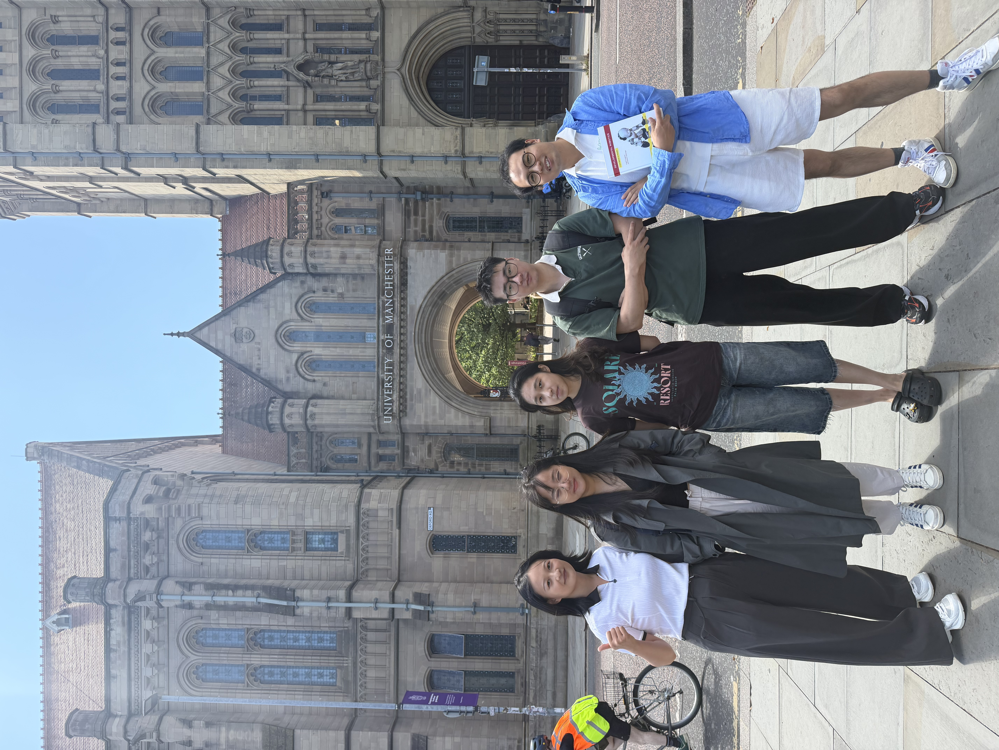
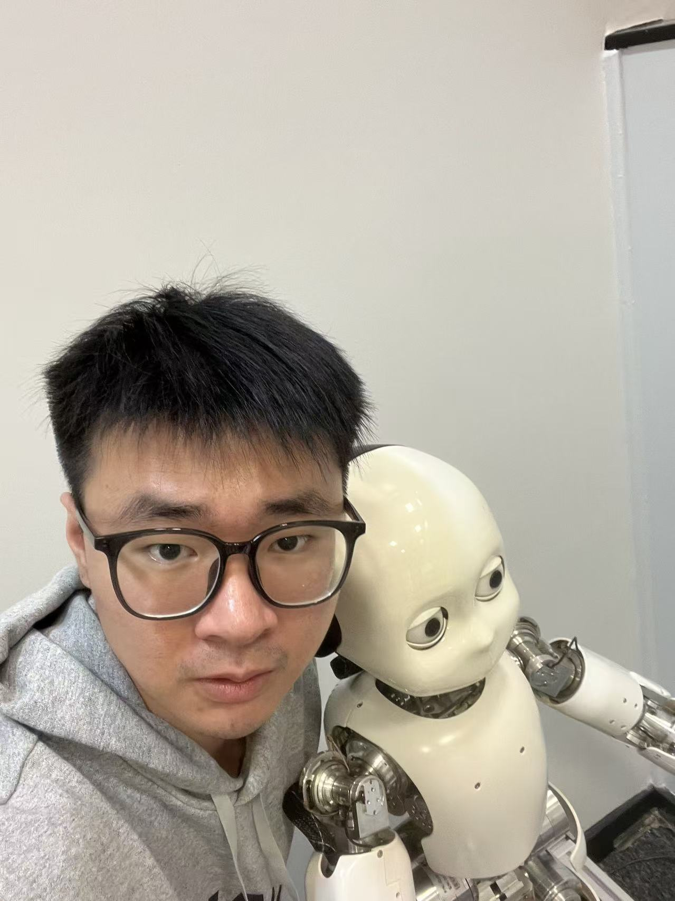
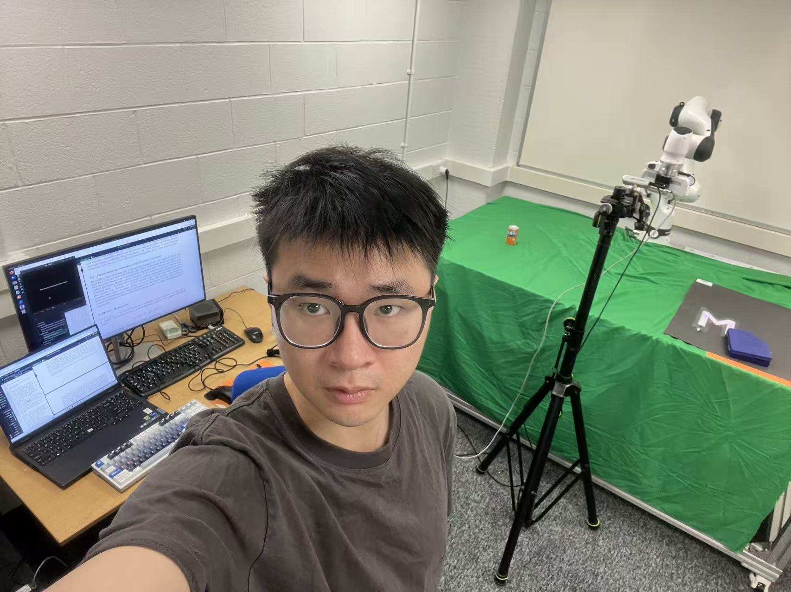

Over the past year, I had the opportunity to work with the **Cognitive Robotics Lab (CoRoLab)** at The University of Manchester. My projects focused on embodied intelligence and spatial reasoning, gradually expanding into object navigation, vision-language reasoning, and robot manipulation.

A particularly valuable part of this experience was learning how to turn broad research questions into controlled experiments. I also became much more interested in the gap between *understanding what should be done* and *executing it reliably in the physical world*.

I am grateful to **Prof. Angelo Cangelosi** for the research environment, and especially to **Dr. Fangjun Li** and **Dr. Zhegong Shangguan** for their guidance and mentorship throughout the work.

This blog will be a place for me to record similar research activities, conference experiences, technical notes, and ideas that do not necessarily belong in a formal paper.

